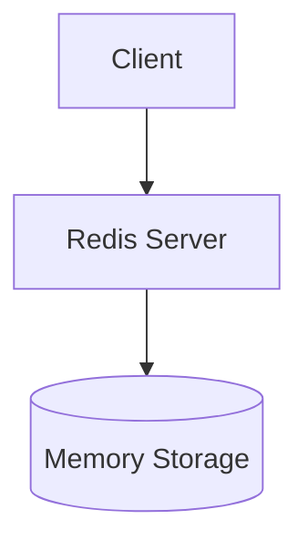
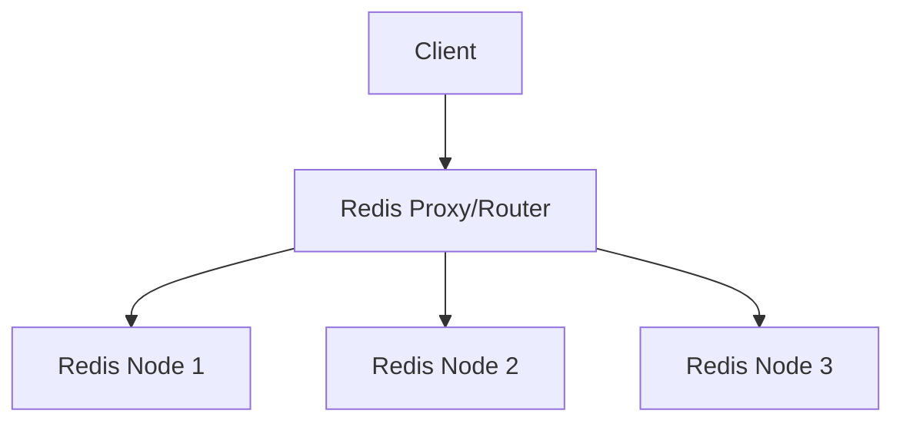

# Redis Architecture and Data Distribution

Redis is a widely-used in-memory data structure store that can be used as a database, cache, message broker, and queue. When dealing with large datasets or high throughput requirements, understanding how Redis distributes data across multiple nodes becomes crucial.

## Single Node vs Distributed Redis

### Single Node Architecture
In a single-node Redis setup:
- All data is stored on one server
- Limited by single machine's memory
- Single point of failure
- No data distribution needed



### Distributed **Architecture**
In a distributed Redis setup:
- Data is spread across multiple nodes
- Higher memory capacity
- Better fault tolerance
- Requires data distribution strategy



## Data Distribution Methods

### 1. Client-side Partitioning
- Application code decides which Redis node to use
- Uses consistent hashing or modulo operation
- No additional proxy layer needed
- More complex application logic

Example client-side sharding in Go:
```go
package redis

import (
    "crypto/sha1"
    "encoding/binary"
    "github.com/go-redis/redis/v8"
)

type ShardedClient struct {
    nodes []*redis.Client
}

func NewShardedClient(addresses []string) *ShardedClient {
    clients := make([]*redis.Client, len(addresses))
    for i, addr := range addresses {
        clients[i] = redis.NewClient(&redis.Options{
            Addr: addr,
        })
    }
    return &ShardedClient{nodes: clients}
}

func (sc *ShardedClient) getNode(key string) *redis.Client {
    // Use SHA1 for better distribution
    hasher := sha1.New()
    hasher.Write([]byte(key))
    hash := binary.BigEndian.Uint64(hasher.Sum(nil))
    return sc.nodes[hash%uint64(len(sc.nodes))]
}

func (sc *ShardedClient) Set(ctx context.Context, key string, value interface{}) error {
    node := sc.getNode(key)
    return node.Set(ctx, key, value, 0).Err()
}

func (sc *ShardedClient) Get(ctx context.Context, key string) (string, error) {
    node := sc.getNode(key)
    return node.Get(ctx, key).Result()
}

// Usage example:
func Example() {
    addresses := []string{
        "redis1:6379",
        "redis2:6379",
        "redis3:6379",
    }
    
    client := NewShardedClient(addresses)
    
    ctx := context.Background()
    err := client.Set(ctx, "user:123", "John Doe")
    if err != nil {
        log.Fatal(err)
    }
    
    value, err := client.Get(ctx, "user:123")
    if err != nil {
        log.Fatal(err)
    }
    fmt.Println(value)
}
```

### 2. Proxy-based Partitioning
- Additional layer between clients and Redis nodes
- Proxy handles data distribution
- Simpler application code
- Additional network hop

Common proxies:
- Twemproxy (Twitter)
- Redis Cluster Proxy
- Codis

### 3. Query Routing
- Redis Cluster native approach
- Nodes communicate directly
- Automatic resharding
- Built-in failover

## Key Distribution Strategies

### Hash Slots
Redis Cluster uses a hash slot approach:
- 16384 hash slots
- Each key is mapped to a slot using CRC16
- Slots are distributed across nodes

Example hash slot calculation in Go:
```go
package redis

import (
    "strings"
)

const (
    HASH_SLOTS = 16384
)

// CRC16 lookup table
var crc16tab = [256]uint16{
    0x0000, 0x1021, 0x2042, 0x3063, 0x4084, 0x50a5, 0x60c6, 0x70e7,
    // ... (full table omitted for brevity)
}

func GetHashSlot(key string) uint16 {
    // Extract hash tag if exists
    start := strings.Index(key, "{")
    end := strings.Index(key, "}")
    if start > -1 && end > -1 && end > start {
        key = key[start+1:end]
    }
    
    // Calculate CRC16
    crc := uint16(0)
    for i := 0; i < len(key); i++ {
        crc = ((crc << 8) & 0xff00) ^ crc16tab[((crc>>8)^uint16(key[i]))&0x00ff]
    }
    
    return crc % HASH_SLOTS
}

type ClusterClient struct {
    slots map[uint16]*redis.Client
}

func NewClusterClient(nodes []string) *ClusterClient {
    // Initialize with slot ranges
    cc := &ClusterClient{
        slots: make(map[uint16]*redis.Client),
    }
    
    slotsPerNode := HASH_SLOTS / len(nodes)
    for i, addr := range nodes {
        client := redis.NewClient(&redis.Options{Addr: addr})
        start := uint16(i * slotsPerNode)
        end := uint16((i + 1) * slotsPerNode)
        
        for slot := start; slot < end; slot++ {
            cc.slots[slot] = client
        }
    }
    
    return cc
}

func (cc *ClusterClient) Set(ctx context.Context, key string, value interface{}) error {
    slot := GetHashSlot(key)
    client := cc.slots[slot]
    return client.Set(ctx, key, value, 0).Err()
}

func (cc *ClusterClient) Get(ctx context.Context, key string) (string, error) {
    slot := GetHashSlot(key)
    client := cc.slots[slot]
    return client.Get(ctx, key).Result()
}
```

### Consistent Hashing
Alternative approach used by some proxy solutions:
- Minimizes remapping when adding/removing nodes
- Based on a hash ring
- Better distribution with virtual nodes

## Performance Considerations

1. Network Overhead
   - Additional latency in distributed setups
   - Need for proper monitoring
   - Network bandwidth becomes crucial

2. Data Locality
   - Related data should be on same node
   - Use hash tags {user123}.profile
   - Reduces multi-node operations

3. Memory Usage
   - Even distribution prevents hot spots
   - Monitor memory usage across nodes
   - Plan for growth and scaling

## Next Steps

In the next post, we'll dive deep into Redis Cluster mode, exploring:
- Cluster topology
- Node communication
- Failover mechanisms
- Configuration best practices

## References

1. Redis Cluster Specification
2. Redis Documentation on Partitioning
3. Redis Cluster Tutorial
