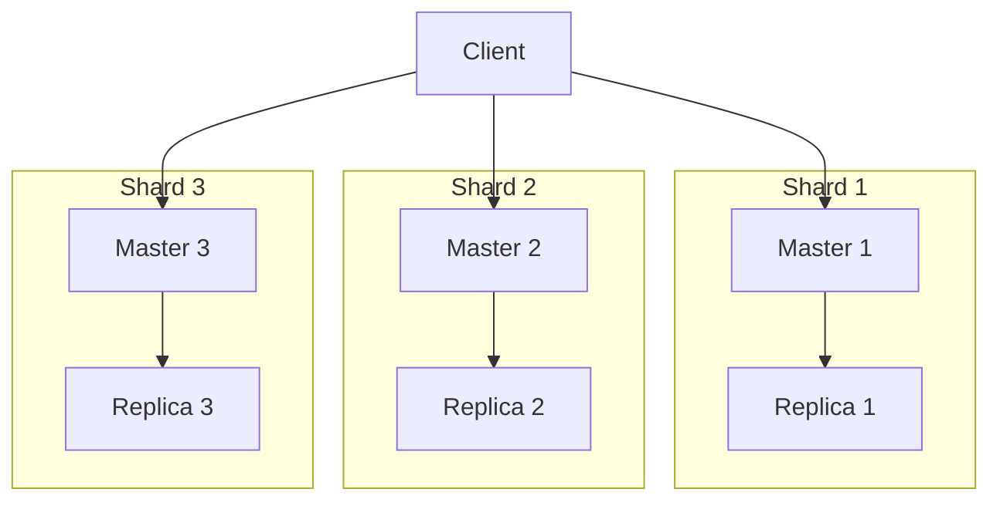
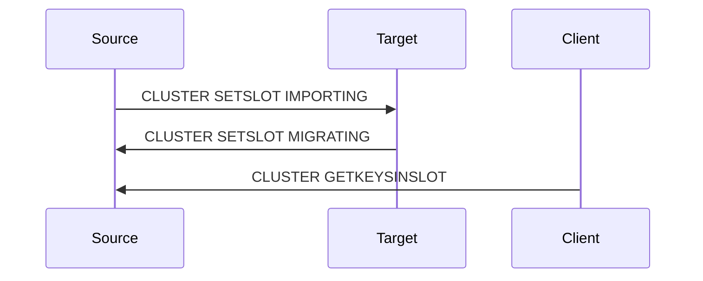
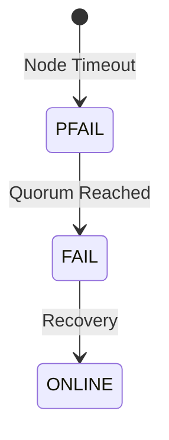
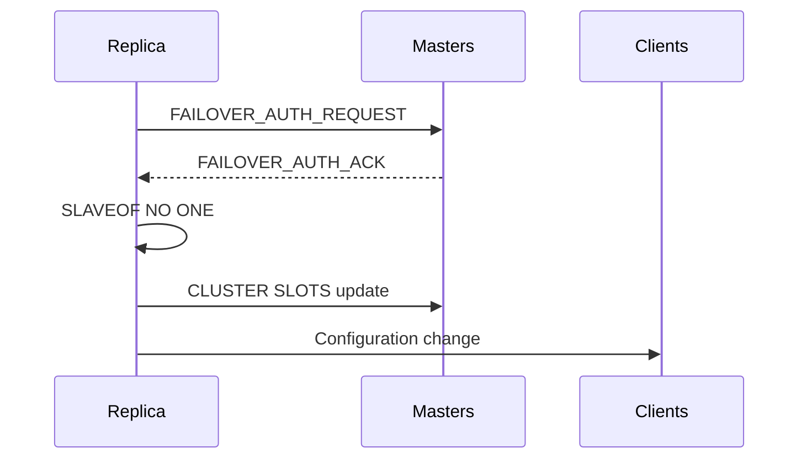

# Understanding Redis Cluster Mode

Redis Cluster is the official distributed implementation of Redis, providing a way to automatically shard data across multiple Redis nodes. This post explores the internal mechanisms of Redis Cluster.

## Cluster Architecture

### Node Types and Roles

1. Master Nodes
   - Handle write operations
   - Own a subset of hash slots
   - Participate in cluster configuration

2. Replica Nodes
   - Copy data from masters
   - Provide read scalability
   - Enable high availability



## Node Communication

### Gossip Protocol
Redis Cluster uses a gossip protocol for node communication:

1. Heartbeat Messages
```plaintext
PING
  node_id=5
  ping_sent=1234567890
  status=master
  slots=[0-5461]
```

2. Response Format
```plaintext
PONG
  node_id=7
  ping_received=1234567890
  status=replica
  master_id=5
```

### Cluster Bus
- Separate port (default: client port + 10000)
- Binary protocol for efficiency
- Used for:
  - Configuration updates
  - Failover authorization
  - State propagation

## Hash Slot Management

### Slot Distribution
The 16384 hash slots are distributed across master nodes:

```python
class RedisClusterNode:
    def __init__(self, id, slots):
        self.id = id
        self.slots = slots

# Example distribution
nodes = [
    RedisClusterNode("A", range(0, 5461)),
    RedisClusterNode("B", range(5461, 10922)),
    RedisClusterNode("C", range(10922, 16384))
]
```

### Resharding Process

1. Preparation Phase


2. Migration Phase
```go
package redis

import (
    "context"
    "fmt"
    "github.com/go-redis/redis/v8"
)

// SlotMigrator handles Redis Cluster slot migration
type SlotMigrator struct {
    source *redis.Client
    target *redis.Client
}

func NewSlotMigrator(source, target *redis.Client) *SlotMigrator {
    return &SlotMigrator{
        source: source,
        target: target,
    }
}

func (sm *SlotMigrator) MigrateSlot(ctx context.Context, slot int, batchSize int) error {
    // Set migration state
    if err := sm.prepareNodes(ctx, slot); err != nil {
        return fmt.Errorf("prepare nodes failed: %v", err)
    }

    // Migrate keys in batches
    for {
        keys, err := sm.source.ClusterGetKeysInSlot(ctx, uint16(slot), int64(batchSize)).Result()
        if err != nil {
            return fmt.Errorf("get keys failed: %v", err)
        }

        if len(keys) == 0 {
            break
        }

        // Migrate batch of keys
        for _, key := range keys {
            if err := sm.migrateKey(ctx, key); err != nil {
                return fmt.Errorf("migrate key %s failed: %v", key, err)
            }
        }
    }

    // Finalize migration
    return sm.finalizeMigration(ctx, slot)
}

func (sm *SlotMigrator) prepareNodes(ctx context.Context, slot int) error {
    targetAddr := sm.target.Options().Addr
    sourceAddr := sm.source.Options().Addr

    // Set source to migrating state
    if err := sm.source.ClusterSetSlotMigrating(ctx, int64(slot), targetAddr).Err(); err != nil {
        return err
    }

    // Set target to importing state
    return sm.target.ClusterSetSlotImporting(ctx, int64(slot), sourceAddr).Err()
}

func (sm *SlotMigrator) migrateKey(ctx context.Context, key string) error {
    host, port, _ := net.SplitHostPort(sm.target.Options().Addr)
    portInt, _ := strconv.Atoi(port)

    return sm.source.ClusterMigrateKey(ctx, host, portInt, key, 0, 5000,
        "COPY", "REPLACE").Err()
}

func (sm *SlotMigrator) finalizeMigration(ctx context.Context, slot int) error {
    return sm.source.ClusterSetSlotNode(ctx, int64(slot), sm.target.Options().Addr).Err()
}

// Example usage
func Example() {
    ctx := context.Background()
    
    source := redis.NewClient(&redis.Options{
        Addr: "source:6379",
    })
    target := redis.NewClient(&redis.Options{
        Addr: "target:6379",
    })
    
    migrator := NewSlotMigrator(source, target)
    
    // Migrate slot 1000 with batch size of 100
    if err := migrator.MigrateSlot(ctx, 1000, 100); err != nil {
        log.Fatal(err)
    }
    
    fmt.Println("Slot migration completed successfully")
}
```

## Fault Detection and Failover

### Failure Detection

1. Node Marking


2. Quorum Calculation
```go
package redis

import (
    "context"
    "github.com/go-redis/redis/v8"
)

// FailureDetector handles node failure detection
type FailureDetector struct {
    client *redis.ClusterClient
    quorum int
}

func NewFailureDetector(addrs []string, quorum int) *FailureDetector {
    client := redis.NewClusterClient(&redis.ClusterOptions{
        Addrs: addrs,
    })
    return &FailureDetector{
        client: client,
        quorum: quorum,
    }
}

func (fd *FailureDetector) IsQuorumReached(ctx context.Context, nodeID string) (bool, error) {
    // Get total masters
    masters, err := fd.getMasterNodes(ctx)
    if err != nil {
        return false, err
    }

    // Get failure marks
    marks, err := fd.getFailureMarks(ctx, nodeID)
    if err != nil {
        return false, err
    }

    return marks > len(masters)/2, nil
}

func (fd *FailureDetector) CheckNodeStatus(ctx context.Context, nodeID string) (string, error) {
    marks, err := fd.getFailureMarks(ctx, nodeID)
    if err != nil {
        return "", err
    }

    quorumReached, err := fd.IsQuorumReached(ctx, nodeID)
    if err != nil {
        return "", err
    }

    switch {
    case marks == 0:
        return "ONLINE", nil
    case marks > 0 && !quorumReached:
        return "PFAIL", nil
    default:
        return "FAIL", nil
    }
}

// Example usage
func Example() {
    ctx := context.Background()
    detector := NewFailureDetector([]string{
        "localhost:6379",
        "localhost:6380",
        "localhost:6381",
    }, 2)

    status, err := detector.CheckNodeStatus(ctx, "node123")
    if err != nil {
        log.Fatal(err)
    }

    fmt.Printf("Node status: %s\n", status)
}
```

### Automatic Failover

1. Replica Election
```plaintext
Conditions for eligibility:
- Replication offset up to date
- Node reachable by majority
- No recent failover
```

2. Failover Process


## Configuration Best Practices

### Minimum Configuration

```conf
port 6379
cluster-enabled yes
cluster-config-file nodes-6379.conf
cluster-node-timeout 5000
appendonly yes
```

### Memory Management

```conf
maxmemory 4gb
maxmemory-policy allkeys-lru
```

### Network Optimization

```conf
tcp-backlog 511
tcp-keepalive 300
```

## Monitoring and Maintenance

### Key Metrics to Monitor

1. Cluster State
```bash
redis-cli CLUSTER INFO
```

2. Node Statistics
```bash
redis-cli INFO CLUSTER
```

3. Slot Distribution
```bash
redis-cli CLUSTER SLOTS
```

### Common Operations

```go
// ClusterManager handles cluster maintenance operations
type ClusterManager struct {
    client *redis.ClusterClient
}

func NewClusterManager(addrs []string) *ClusterManager {
    client := redis.NewClusterClient(&redis.ClusterOptions{
        Addrs: addrs,
    })
    return &ClusterManager{client: client}
}

// AddNode adds a new node to the cluster
func (cm *ClusterManager) AddNode(ctx context.Context, newNodeAddr, existingNodeAddr string) error {
    // Meet the new node
    if err := cm.client.ClusterMeet(ctx, newNodeAddr).Err(); err != nil {
        return fmt.Errorf("cluster meet failed: %v", err)
    }

    // Wait for node to join
    return cm.waitForNodeJoin(ctx, newNodeAddr)
}

// RemoveNode removes a node from the cluster
func (cm *ClusterManager) RemoveNode(ctx context.Context, nodeID string) error {
    // Check if node has slots
    slots, err := cm.client.ClusterSlots(ctx).Result()
    if err != nil {
        return err
    }

    // Ensure node has no slots assigned
    for _, slot := range slots {
        if slot.Nodes[0].ID == nodeID {
            return fmt.Errorf("node %s still has slots assigned", nodeID)
        }
    }

    // Remove node
    return cm.client.ClusterForget(ctx, nodeID).Err()
}

// RebalanceCluster redistributes slots evenly
func (cm *ClusterManager) RebalanceCluster(ctx context.Context, threshold float64) error {
    // Get current distribution
    slots, err := cm.client.ClusterSlots(ctx).Result()
    if err != nil {
        return err
    }

    // Calculate target distribution
    masterNodes := make([]string, 0)
    slotsPerNode := make(map[string]int)
    
    for _, slot := range slots {
        nodeID := slot.Nodes[0].ID
        masterNodes = append(masterNodes, nodeID)
        slotsPerNode[nodeID] += slot.End - slot.Start + 1
    }

    targetSlots := HASH_SLOTS / len(masterNodes)
    migrator := NewSlotMigrator(nil, nil) // Will set dynamically

    // Rebalance
    for sourceID, count := range slotsPerNode {
        if float64(count) > float64(targetSlots)*(1+threshold) {
            // Node has too many slots, migrate some
            excess := count - targetSlots
            for targetID, targetCount := range slotsPerNode {
                if targetCount < targetSlots {
                    toMigrate := min(excess, targetSlots-targetCount)
                    if err := cm.migrateSlots(ctx, sourceID, targetID, toMigrate); err != nil {
                        return err
                    }
                    excess -= toMigrate
                    if excess <= 0 {
                        break
                    }
                }
            }
        }
    }

    return nil
}

// Example usage
func Example() {
    ctx := context.Background()
    manager := NewClusterManager([]string{
        "localhost:6379",
        "localhost:6380",
    })

    // Add new node
    if err := manager.AddNode(ctx, "new-node:6379", "localhost:6379"); err != nil {
        log.Fatal(err)
    }

    // Rebalance cluster with 10% threshold
    if err := manager.RebalanceCluster(ctx, 0.1); err != nil {
        log.Fatal(err)
    }

    fmt.Println("Cluster operations completed successfully")
}
```

## Next Steps

In the next post, we'll explore Redis High Availability and failover mechanisms in detail, including:
- Sentinel architecture
- Automatic failover configuration
- Split-brain prevention
- Monitoring and alerting

## References

1. Redis Cluster Specification
2. Redis Cluster Internal Documentation
3. Redis Configuration Best Practices
