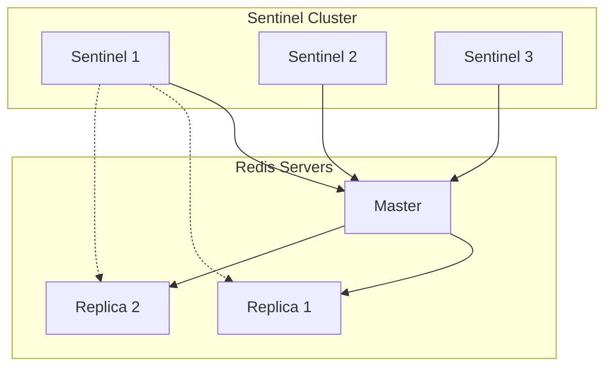
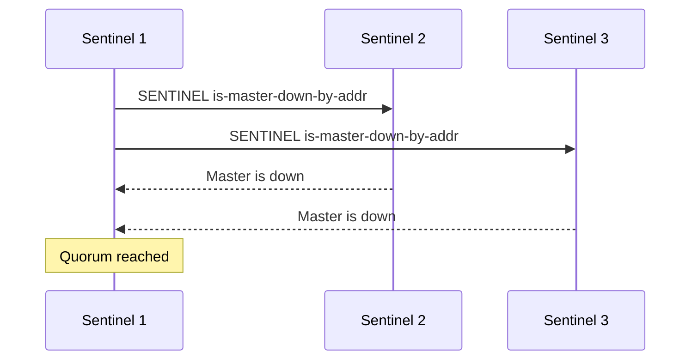

# Redis Failover and High Availability

High availability in Redis is achieved through a combination of replication, automatic failover, and monitoring. This post explores these mechanisms in detail.

## Redis Sentinel

### Architecture



### Sentinel Configuration

```conf
port 26379
sentinel monitor mymaster 127.0.0.1 6379 2
sentinel down-after-milliseconds mymaster 5000
sentinel failover-timeout mymaster 60000
sentinel parallel-syncs mymaster 1
```

### Implementation Details

```python
class RedisSentinel:
    def __init__(self, sentinel_nodes):
        self.sentinels = sentinel_nodes
        self.quorum = len(sentinel_nodes) // 2 + 1
    
    def monitor_master(self, master_name, master_host, master_port):
        """Configure sentinel monitoring"""
        for sentinel in self.sentinels:
            sentinel.execute_command(
                "SENTINEL", "MONITOR",
                master_name, master_host, master_port,
                self.quorum
            )
```

## Automatic Failover

### Detection Phase

```python
class FailureDetector:
    def __init__(self, timeout_ms):
        self.timeout = timeout_ms
        self.last_response = {}
    
    def check_node(self, node_id, last_ping_time):
        """Check if node is down"""
        if time.time() - last_ping_time > self.timeout:
            return "SDOWN"  # Subjectively down
        return "ONLINE"
```

### Consensus Building



### Failover Process

```python
class FailoverProcess:
    def __init__(self, sentinel_cluster):
        self.cluster = sentinel_cluster
    
    async def execute_failover(self, master_name):
        # Phase 1: Leader election
        if not self.cluster.elect_leader():
            return False
        
        # Phase 2: Select new master
        new_master = self.select_new_master()
        if not new_master:
            return False
        
        # Phase 3: Promote replica to master
        if not await self.promote_replica(new_master):
            return False
        
        # Phase 4: Reconfigure other replicas
        await self.reconfigure_replicas(new_master)
        return True
    
    def select_new_master(self):
        """Select the best replica to promote"""
        replicas = self.cluster.get_replicas()
        return max(replicas, key=lambda r: (
            r.priority,
            r.replication_offset,
            r.run_id
        ))
```

## Split-brain Prevention

### Network Partition Handling

```python
class NetworkPartitionHandler:
    def __init__(self, min_replicas):
        self.min_replicas = min_replicas
    
    def can_process_writes(self, visible_replicas):
        """Check if master can accept writes"""
        return len(visible_replicas) >= self.min_replicas
    
    def handle_partition(self, node_type, visible_nodes):
        if node_type == "master":
            if not self.can_process_writes(visible_nodes):
                return "stop_writes"
        return "continue_operation"
```

### Quorum Management

```python
def calculate_quorum_status(total_sentinels):
    """Calculate minimum sentinels needed"""
    return {
        'minimum': (total_sentinels // 2) + 1,
        'recommended': (total_sentinels * 2 // 3) + 1
    }

class QuorumManager:
    def __init__(self, total_sentinels):
        self.quorum = calculate_quorum_status(total_sentinels)
    
    def has_quorum(self, available_sentinels):
        return len(available_sentinels) >= self.quorum['minimum']
```

## High Availability Configuration

### Redis Configuration

```conf
# Master node
port 6379
requirepass "strong_password"
masterauth "strong_password"
protected-mode yes

# Replica node
port 6380
replicaof 127.0.0.1 6379
masterauth "strong_password"
replica-read-only yes
```

### Persistence Settings

```conf
# AOF configuration
appendonly yes
appendfsync everysec
no-appendfsync-on-rewrite yes
auto-aof-rewrite-percentage 100
auto-aof-rewrite-min-size 64mb

# RDB configuration
save 900 1
save 300 10
save 60 10000
```

## Monitoring and Maintenance

### Health Checks

```python
class HealthChecker:
    def __init__(self, redis_cluster):
        self.cluster = redis_cluster
    
    async def check_cluster_health(self):
        results = {
            'nodes': await self.check_nodes(),
            'slots': self.check_slots(),
            'replication': await self.check_replication()
        }
        return results
    
    async def check_nodes(self):
        node_status = {}
        for node in self.cluster.nodes:
            try:
                response = await node.ping()
                node_status[node.id] = 'alive' if response else 'dead'
            except Exception as e:
                node_status[node.id] = f'error: {str(e)}'
        return node_status
```

### Metrics Collection

```python
class RedisMetricsCollector:
    def __init__(self, redis_node):
        self.node = redis_node
    
    def collect_metrics(self):
        return {
            'memory': self.get_memory_metrics(),
            'clients': self.get_client_metrics(),
            'operations': self.get_operation_metrics()
        }
    
    def get_memory_metrics(self):
        info = self.node.info('memory')
        return {
            'used_memory': info['used_memory'],
            'used_memory_rss': info['used_memory_rss'],
            'mem_fragmentation_ratio': info['mem_fragmentation_ratio']
        }
```

## Disaster Recovery

### Backup Strategy

```python
class RedisBackup:
    def __init__(self, redis_node):
        self.node = redis_node
    
    async def create_backup(self, backup_path):
        """Create backup using RDB"""
        try:
            # Save current state
            await self.node.bgsave()
            
            # Wait for RDB completion
            while True:
                info = await self.node.info('persistence')
                if info['rdb_bgsave_in_progress'] == 0:
                    break
                await asyncio.sleep(1)
            
            # Copy RDB file
            shutil.copy(
                self.node.config_get('dbfilename'),
                backup_path
            )
            return True
        except Exception as e:
            logging.error(f"Backup failed: {str(e)}")
            return False
```

### Recovery Procedures

```python
class RedisRecovery:
    def __init__(self, cluster):
        self.cluster = cluster
    
    async def recover_node(self, node_id, backup_path):
        """Recover a failed node"""
        steps = [
            self.stop_node,
            self.restore_backup,
            self.start_node,
            self.verify_recovery
        ]
        
        for step in steps:
            try:
                await step(node_id, backup_path)
            except Exception as e:
                logging.error(f"Recovery step failed: {str(e)}")
                return False
        return True
```

## Best Practices

1. Sentinel Configuration
```python
def configure_sentinel(sentinel_count):
    return {
        'quorum': math.ceil(sentinel_count/2),
        'down_after_milliseconds': 5000,
        'failover_timeout': 60000,
        'parallel_syncs': 1
    }
```

2. Network Requirements
```python
def check_network_requirements():
    return {
        'max_latency': '10ms',
        'bandwidth': '100Mbps',
        'reliability': '99.99%',
        'port_requirements': [
            6379,  # Redis
            26379, # Sentinel
            16379  # Cluster bus
        ]
    }
```

3. Monitoring Checklist
```python
def monitoring_checklist():
    return [
        'Memory usage',
        'Network latency',
        'Replication offset',
        'Connected clients',
        'Command execution rate',
        'Keyspace hits/misses',
        'Sentinel quorum status'
    ]
```

## References

1. Redis Sentinel Documentation
2. Redis High Availability Guide
3. Redis Cluster Administration
