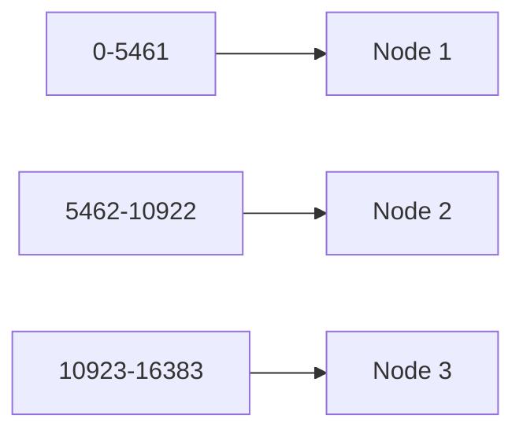
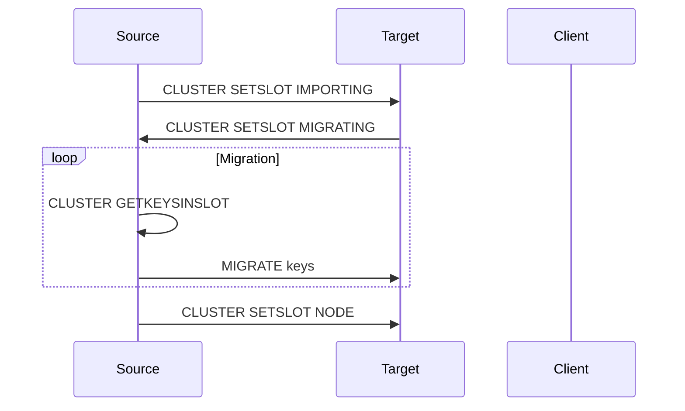

# Redis Hash Slots and Sharding Mechanisms

Hash slots are fundamental to Redis Cluster's data distribution mechanism. This post explores the implementation details and best practices for working with hash slots.

## Hash Slot Implementation

### CRC16 Algorithm

Redis uses CRC16 for hash slot calculation:

```c
static unsigned int crc16(const char *buf, int len) {
    int counter;
    unsigned int crc = 0;
    for (counter = 0; counter < len; counter++) {
        crc = (crc << 8) ^ crc16tab[((crc >> 8) ^ *buf++) & 0x00FF];
    }
    return crc;
}
```

### Key to Slot Mapping

```go
package redis

import (
    "strings"
)

const HASH_SLOTS = 16384

// GetHashSlot calculates the hash slot for a key
func GetHashSlot(key string) uint16 {
    // Extract hash tag if exists
    start := strings.Index(key, "{")
    end := strings.Index(key, "}")
    if start > -1 && end > -1 && end > start {
        key = key[start+1:end]
    }
    
    // Calculate CRC16
    crc := uint16(0)
    for i := 0; i < len(key); i++ {
        crc = ((crc << 8) & 0xff00) ^ crc16tab[((crc>>8)^uint16(key[i]))&0x00ff]
    }
    
    return crc % HASH_SLOTS
}

// Example usage
func Example() {
    keys := []string{
        "user:123",
        "{user:456}.profile",
        "product:789",
    }
    
    for _, key := range keys {
        slot := GetHashSlot(key)
        fmt.Printf("Key %s -> slot %d\n", key, slot)
    }
}
```

## Hash Slot Distribution

### Static Distribution



### Dynamic Rebalancing

```python
class ClusterNode:
    def __init__(self, id, slots=None):
        self.id = id
        self.slots = slots or set()

def rebalance_slots(nodes):
    """Redistribute slots evenly"""
    total_slots = 16384
    slots_per_node = total_slots // len(nodes)
    
    # Basic distribution
    for i, node in enumerate(nodes):
        start = i * slots_per_node
        end = start + slots_per_node
        node.slots = set(range(start, end))
```

## Hash Tags

### Implementation

Hash tags allow multiple keys to be mapped to the same hash slot:

```go
package redis

import (
    "context"
    "strings"
    "github.com/go-redis/redis/v8"
)

// RedisKey represents a key with hash tag support
type RedisKey struct {
    Key     string
    HashTag string
}

func NewRedisKey(key string) *RedisKey {
    return &RedisKey{
        Key:     key,
        HashTag: extractHashTag(key),
    }
}

func extractHashTag(key string) string {
    start := strings.Index(key, "{")
    end := strings.Index(key, "}")
    if start > -1 && end > -1 && end > start {
        return key[start+1:end]
    }
    return key
}

// HashTagOperations handles operations on keys with same hash tag
type HashTagOperations struct {
    client *redis.ClusterClient
}

func NewHashTagOperations(addrs []string) *HashTagOperations {
    client := redis.NewClusterClient(&redis.ClusterOptions{
        Addrs: addrs,
    })
    return &HashTagOperations{client: client}
}

// Example of atomic operations using hash tags
func (h *HashTagOperations) AtomicUserOperations(ctx context.Context, userID string) error {
    // All these operations will go to the same hash slot
    pipe := h.client.Pipeline()
    keyPrefix := fmt.Sprintf("{user:%s}", userID)
    
    // Update profile
    pipe.HSet(ctx, keyPrefix+".profile",
        "last_login", time.Now().String(),
        "login_count", 1)
    
    // Update settings
    pipe.HSet(ctx, keyPrefix+".settings",
        "theme", "dark",
        "notifications", "enabled")
    
    // Add to active users set
    pipe.SAdd(ctx, keyPrefix+".sessions", "session123")
    
    // Execute all commands atomically
    _, err := pipe.Exec(ctx)
    return err
}
```

### Use Cases

1. Related Data Grouping
```python
# Keys mapped to same slot
user_keys = [
    "{user123}.profile",
    "{user123}.preferences",
    "{user123}.settings"
]
```

2. Transaction Support
// Example usage of hash tags
```go
func Example() {
    ctx := context.Background()
    ops := NewHashTagOperations([]string{
        "localhost:6379",
        "localhost:6380",
        "localhost:6381",
    })
    
    // Perform atomic operations
    err := ops.AtomicUserOperations(ctx, "user123")
    if err != nil {
        log.Fatal(err)
    }
    
    // Verify all keys are in same slot
    keys := []string{
        "{user:123}.profile",
        "{user:123}.settings",
        "{user:123}.sessions",
    }
    
    slot := GetHashSlot(keys[0])
    for _, key := range keys[1:] {
        if GetHashSlot(key) != slot {
            log.Fatal("Keys are not in the same slot!")
        }
    }
}
```

## Slot Migration

### Migration Protocol



### Implementation Example

```python
class SlotMigrator:
    def __init__(self, source, target, slot):
        self.source = source
        self.target = target
        self.slot = slot
    
    def migrate(self, batch_size=1000):
        # Prepare nodes
        self.source.cluster_setslot_migrating(self.slot, self.target.id)
        self.target.cluster_setslot_importing(self.slot, self.source.id)
        
        # Migrate keys in batches
        while True:
            keys = self.source.cluster_getkeysinslot(self.slot, batch_size)
            if not keys:
                break
            
            for key in keys:
                self.migrate_key(key)
        
        # Finish migration
        self.source.cluster_setslot_node(self.slot, self.target.id)
    
    def migrate_key(self, key):
        self.source.migrate(
            host=self.target.host,
            port=self.target.port,
            key=key,
            timeout_ms=5000
        )
```

## Performance Optimization

### Hot Spot Prevention

1. Key Distribution Analysis
```go
// DistributionAnalyzer analyzes key distribution across slots
type DistributionAnalyzer struct {
    client *redis.ClusterClient
}

func NewDistributionAnalyzer(addrs []string) *DistributionAnalyzer {
    client := redis.NewClusterClient(&redis.ClusterOptions{
        Addrs: addrs,
    })
    return &DistributionAnalyzer{client: client}
}

func (da *DistributionAnalyzer) AnalyzeKeyDistribution(ctx context.Context) ([]int, error) {
    // Initialize slot counters
    slotCounts := make([]int, HASH_SLOTS)
    
    // Scan all keys
    iter := da.client.Scan(ctx, 0, "*", 0).Iterator()
    for iter.Next(ctx) {
        key := iter.Val()
        slot := GetHashSlot(key)
        slotCounts[slot]++
    }
    
    if err := iter.Err(); err != nil {
        return nil, fmt.Errorf("scan error: %v", err)
    }
    
    return slotCounts, nil
}

// HotSpotDetector detects hot spots in the cluster
type HotSpotDetector struct {
    threshold float64
}

func NewHotSpotDetector(threshold float64) *HotSpotDetector {
    return &HotSpotDetector{threshold: threshold}
}

func (hd *HotSpotDetector) DetectHotSlots(slotCounts []int) []HotSlot {
    // Calculate average
    total := 0
    for _, count := range slotCounts {
        total += count
    }
    avg := float64(total) / float64(len(slotCounts))
    
    // Detect hot slots
    hotSlots := make([]HotSlot, 0)
    for slot, count := range slotCounts {
        if float64(count) > avg*hd.threshold {
            hotSlots = append(hotSlots, HotSlot{
                Slot:     slot,
                KeyCount: count,
                LoadFactor: float64(count) / avg,
            })
        }
    }
    
    // Sort by load factor
    sort.Slice(hotSlots, func(i, j int) bool {
        return hotSlots[i].LoadFactor > hotSlots[j].LoadFactor
    })
    
    return hotSlots
}

type HotSlot struct {
    Slot       int
    KeyCount   int
    LoadFactor float64
}

// Example usage
func Example() {
    ctx := context.Background()
    analyzer := NewDistributionAnalyzer([]string{
        "localhost:6379",
        "localhost:6380",
    })
    
    // Analyze distribution
    slotCounts, err := analyzer.AnalyzeKeyDistribution(ctx)
    if err != nil {
        log.Fatal(err)
    }
    
    // Detect hot spots
    detector := NewHotSpotDetector(1.5) // 50% above average
    hotSlots := detector.DetectHotSlots(slotCounts)
    
    // Print results
    for _, hs := range hotSlots {
        fmt.Printf("Hot slot %d: %d keys (%.2fx average load)\n",
            hs.Slot, hs.KeyCount, hs.LoadFactor)
    }
}
```

### Key Design Best Practices

1. Avoid Sequential Keys
```python
# Bad: Sequential keys in same slot
user:1, user:2, user:3

# Better: Add random prefix
r5:user:1, r3:user:2, r7:user:3
```

2. Use Hash Tags Wisely
```python
# Group related data
{user:1000}.profile
{user:1000}.sessions
{user:1000}.preferences

# Avoid over-grouping
{app:1}.* # Too many keys in one slot
```

## Monitoring and Troubleshooting

### Slot Coverage Verification

```go
// ClusterMonitor handles cluster monitoring operations
type ClusterMonitor struct {
    client *redis.ClusterClient
}

func NewClusterMonitor(addrs []string) *ClusterMonitor {
    client := redis.NewClusterClient(&redis.ClusterOptions{
        Addrs: addrs,
    })
    return &ClusterMonitor{client: client}
}

// VerifySlotCoverage ensures all slots are assigned to nodes
func (cm *ClusterMonitor) VerifySlotCoverage(ctx context.Context) (bool, []int, error) {
    // Get cluster slots information
    slots, err := cm.client.ClusterSlots(ctx).Result()
    if err != nil {
        return false, nil, fmt.Errorf("failed to get cluster slots: %v", err)
    }
    
    // Track covered slots
    covered := make(map[int]bool)
    for _, slot := range slots {
        for i := slot.Start; i <= slot.End; i++ {
            covered[i] = true
        }
    }
    
    // Find missing slots
    missing := make([]int, 0)
    for i := 0; i < HASH_SLOTS; i++ {
        if !covered[i] {
            missing = append(missing, i)
        }
    }
    
    return len(missing) == 0, missing, nil
}

// CheckSlotBalance verifies even distribution of slots
func (cm *ClusterMonitor) CheckSlotBalance(ctx context.Context) (*BalanceReport, error) {
    slots, err := cm.client.ClusterSlots(ctx).Result()
    if err != nil {
        return nil, fmt.Errorf("failed to get cluster slots: %v", err)
    }
    
    // Count slots per node
    slotsPerNode := make(map[string]int)
    for _, slot := range slots {
        nodeID := slot.Nodes[0].ID // Master node
        count := slot.End - slot.Start + 1
        slotsPerNode[nodeID] += count
    }
    
    // Calculate metrics
    avgSlots := float64(HASH_SLOTS) / float64(len(slotsPerNode))
    maxDiff := 0.0
    for _, count := range slotsPerNode {
        diff := math.Abs(float64(count) - avgSlots)
        if diff > maxDiff {
            maxDiff = diff
        }
    }
    
    return &BalanceReport{
        NodesCount:    len(slotsPerNode),
        AverageSlots:  avgSlots,
        MaxImbalance:  maxDiff / avgSlots * 100, // percentage
        SlotsPerNode:  slotsPerNode,
        IsBalanced:    maxDiff/avgSlots <= 0.1, // 10% threshold
    }, nil
}

type BalanceReport struct {
    NodesCount    int
    AverageSlots  float64
    MaxImbalance  float64
    SlotsPerNode  map[string]int
    IsBalanced    bool
}

// Example usage
func Example() {
    ctx := context.Background()
    monitor := NewClusterMonitor([]string{
        "localhost:6379",
        "localhost:6380",
        "localhost:6381",
    })
    
    // Check slot coverage
    covered, missing, err := monitor.VerifySlotCoverage(ctx)
    if err != nil {
        log.Fatal(err)
    }
    
    if !covered {
        fmt.Printf("Missing slots: %v\n", missing)
    } else {
        fmt.Println("All slots are covered")
    }
    
    // Check slot balance
    report, err := monitor.CheckSlotBalance(ctx)
    if err != nil {
        log.Fatal(err)
    }
    
    fmt.Printf("Cluster balance report:\n")
    fmt.Printf("Nodes: %d\n", report.NodesCount)
    fmt.Printf("Average slots per node: %.2f\n", report.AverageSlots)
    fmt.Printf("Maximum imbalance: %.2f%%\n", report.MaxImbalance)
    fmt.Printf("Is balanced: %v\n", report.IsBalanced)
}
```

## Next Steps

In the final post of this series, we'll explore:
- Redis Failover mechanisms
- High Availability configurations
- Cluster management tools
- Production deployment strategies

## References

1. Redis Cluster Specification
2. CRC16 Algorithm Documentation
3. Redis Key Distribution Guidelines
